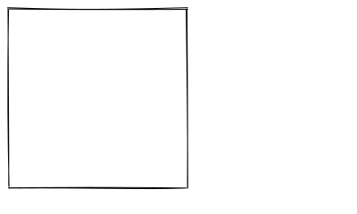
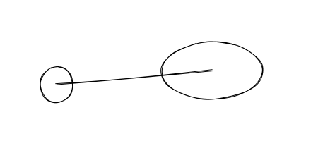
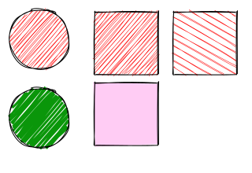
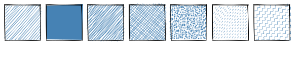
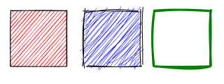
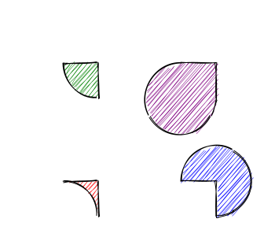
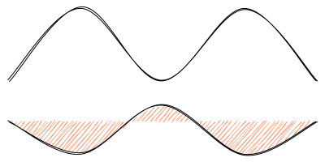
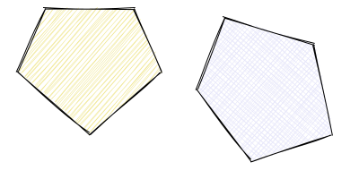
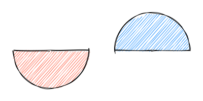
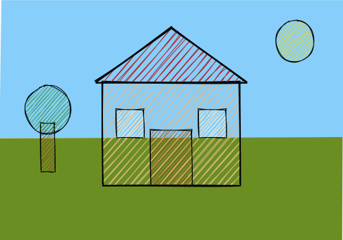

# Roughrb

**Roughrb** is a Ruby graphics library that lets you draw in a _sketchy_, _hand-drawn-like_ style.
It defines primitives to draw lines, curves, arcs, polygons, circles, and ellipses. It also supports drawing [SVG paths](https://developer.mozilla.org/en-US/docs/Web/SVG/Tutorial/Paths).

This is a Ruby port of [rough.js](https://github.com/rough-stuff/rough) by Preet Shihn. SVG output only, zero runtime dependencies.

## Install

Add to your Gemfile:

```ruby
gem "roughrb"
```

Or install directly:

```
gem install roughrb
```

## Usage

Every drawing method on `Rough::SVG` returns an **XML string fragment** — a `<g>` element containing one or more `<path>` elements. These fragments are meant to be concatenated with `+` and placed inside an SVG document.

```ruby
require "rough"

svg = Rough::SVG.new
svg.rectangle(10, 10, 200, 200, seed: 42)
# => "<g><path d=\"M...\" stroke=\"#000\" stroke-width=\"1\" fill=\"none\"/></g>"
```

Use `+` to combine multiple shapes into a single string, then wrap them in a complete SVG document with `Rough::SVG.document`:

```ruby
doc = Rough::SVG.document(400, 240) do |svg|
  svg.rectangle(10, 10, 200, 200, seed: 42)
end
File.write("output.svg", doc)
```

The block should return the XML string to embed — either a single fragment or several concatenated with `+`.



### Lines and Ellipses

```ruby
Rough::SVG.document(450, 200) do |svg|
  svg.circle(80, 120, 50, seed: 42) +          # centerX, centerY, diameter
  svg.ellipse(300, 100, 150, 80, seed: 42) +   # centerX, centerY, width, height
  svg.line(80, 120, 300, 100, seed: 42)         # x1, y1, x2, y2
end
```



### Filling

```ruby
Rough::SVG.document(320, 220) do |svg|
  svg.circle(50, 50, 80, seed: 1, fill: "red") +
  svg.rectangle(120, 15, 80, 80, seed: 1, fill: "red") +
  svg.circle(50, 150, 80, seed: 1,
    fill: "rgb(10,150,10)",
    fill_weight: 3                                     # thicker fill lines
  ) +
  svg.rectangle(220, 15, 80, 80, seed: 1,
    fill: "red",
    hachure_angle: 60,                                 # angle of hachure
    hachure_gap: 8
  ) +
  svg.rectangle(120, 105, 80, 80, seed: 1,
    fill: "rgba(255,0,200,0.2)",
    fill_style: "solid"                                # solid fill
  )
end
```



### Fill Styles

Fill styles: **hachure** (default), **solid**, **zigzag**, **cross-hatch**, **dots**, **dashed**, **zigzag-line**

```ruby
styles = %w[hachure solid zigzag cross-hatch dots dashed zigzag-line]

Rough::SVG.document(600, 120) do |svg|
  styles.map.with_index do |style, i|
    svg.rectangle(10 + i * 82, 10, 70, 70, seed: 42, fill: "steelblue", fill_style: style)
  end.join
end
```



### Sketching Style

```ruby
Rough::SVG.document(320, 120) do |svg|
  svg.rectangle(15, 15, 80, 80, seed: 1, roughness: 0.5, fill: "red") +
  svg.rectangle(120, 15, 80, 80, seed: 1, roughness: 2.8, fill: "blue") +
  svg.rectangle(220, 15, 80, 80, seed: 1, bowing: 6, stroke: "green", stroke_width: 3)
end
```



### SVG Paths

```ruby
Rough::SVG.document(350, 320) do |svg|
  svg.path("M80 80 A 45 45, 0, 0, 0, 125 125 L 125 80 Z", seed: 1, fill: "green") +
  svg.path("M230 80 A 45 45, 0, 1, 0, 275 125 L 275 80 Z", seed: 1, fill: "purple") +
  svg.path("M80 230 A 45 45, 0, 0, 1, 125 275 L 125 230 Z", seed: 1, fill: "red") +
  svg.path("M230 230 A 45 45, 0, 1, 1, 275 275 L 275 230 Z", seed: 1, fill: "blue")
end
```



### Curves

```ruby
Rough::SVG.document(400, 200) do |svg|
  svg.curve([[10, 100], [100, 10], [200, 100], [300, 10], [390, 100]], seed: 42) +
  svg.curve([[10, 150], [100, 190], [200, 130], [300, 190], [390, 150]], seed: 42, fill: "coral")
end
```



### Polygons

```ruby
Rough::SVG.document(400, 200) do |svg|
  svg.polygon([[50, 10], [150, 10], [180, 80], [100, 150], [20, 80]], seed: 42, fill: "khaki") +
  svg.polygon([[250, 20], [350, 50], [370, 150], [280, 180], [220, 100]], seed: 42,
    fill: "lavender", fill_style: "cross-hatch")
end
```



### Arcs

```ruby
Rough::SVG.document(400, 200) do |svg|
  svg.arc(100, 100, 150, 150, 0, Math::PI, closed: true, seed: 42, fill: "tomato") +
  svg.arc(300, 100, 150, 150, Math::PI, Math::PI * 2, closed: true, seed: 42, fill: "dodgerblue")
end
```



### Full Composition

```ruby
Rough::SVG.document(500, 350) do |svg|
  svg.rectangle(0, 0, 500, 200, seed: 10, fill: "lightskyblue", fill_style: "solid", stroke: "none") +
  svg.rectangle(0, 200, 500, 150, seed: 11, fill: "olivedrab", fill_style: "solid", stroke: "none") +
  svg.rectangle(150, 120, 200, 150, seed: 42, fill: "burlywood", stroke_width: 2) +
  svg.polygon([[140, 120], [250, 40], [360, 120]], seed: 42, fill: "firebrick", stroke_width: 2) +
  svg.rectangle(220, 190, 60, 80, seed: 42, fill: "saddlebrown") +
  svg.rectangle(170, 160, 40, 40, seed: 42, fill: "lightyellow") +
  svg.rectangle(290, 160, 40, 40, seed: 42, fill: "lightyellow") +
  svg.circle(430, 60, 60, seed: 42, fill: "gold") +
  svg.rectangle(60, 180, 20, 70, seed: 42, fill: "saddlebrown") +
  svg.circle(70, 160, 70, seed: 42, fill: "forestgreen")
end
```



### Using the Generator Directly

If you want the raw path data without SVG markup, use `Rough::Generator`:

```ruby
gen = Rough::Generator.new
drawable = gen.rectangle(10, 10, 200, 100, seed: 42)
paths = gen.to_paths(drawable)

paths.each do |path_info|
  puts path_info.d           # SVG path "d" attribute
  puts path_info.stroke      # stroke color
  puts path_info.stroke_width
  puts path_info.fill
end
```

## Options

| Option | Default | Description |
|--------|---------|-------------|
| `roughness` | 1 | Numerical value indicating how rough the drawing is. 0 = architect, higher = rougher |
| `bowing` | 1 | Numerical value indicating how much bowing is in the lines |
| `stroke` | `"#000"` | Color of the drawn lines |
| `stroke_width` | 1 | Width of the drawn lines |
| `fill` | `nil` | Fill color. When set, shapes are filled |
| `fill_style` | `"hachure"` | Fill style: hachure, solid, zigzag, cross-hatch, dots, dashed, zigzag-line |
| `fill_weight` | -1 | Weight of fill lines. -1 = half of stroke_width |
| `hachure_angle` | -41 | Angle of hachure lines in degrees |
| `hachure_gap` | -1 | Gap between hachure lines. -1 = stroke_width * 4 |
| `seed` | 0 | Seed for the random number generator. Same seed = same drawing. 0 = non-deterministic |
| `disable_multi_stroke` | false | Don't draw each line twice (less hand-drawn look but faster) |
| `preserve_vertices` | false | Don't randomize endpoints |

## Credits

Ruby port based on [rough.js](https://github.com/rough-stuff/rough) by [Preet Shihn](https://github.com/pshihn).

Core algorithms adapted from [handy](https://www.gicentre.net/software/#/handy/) processing lib. Arc-to-cubic conversion adapted from [Mozilla codebase](https://hg.mozilla.org/mozilla-central/file/17156fbebbc8/content/svg/content/src/nsSVGPathDataParser.cpp#l887).

## License

[MIT License](LICENSE)
